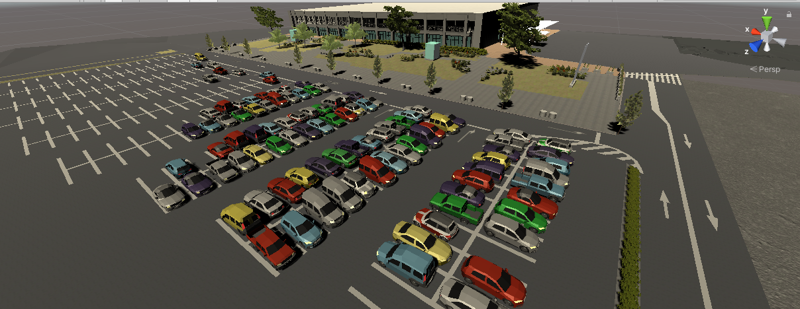

# vtc_world_unity
  
Virtual Tsukuba Challenge on Unity world data.  

[The Virtual Tsukuba Challenge (VTC) using Unreal Engine](https://github.com/furo-org/VTC) has been developed by [fuRo](https://www.furo.org/).

This repository is ONLY for the world (environment) data of VTC.  
If you may have interests including robot model, visit [vtc_unity](https://github.com/Field-Robotics-Japan/vtc_unity) repo, please.

If you have any Issues, or need bug tracking, visit [vtc_unity/issues](https://github.com/Field-Robotics-Japan/vtc_unity/issues) page, please.

# Installation
Thanks to [@ssilph](https://github.com/ssilph) from [#8](https://github.com/Field-Robotics-Japan/vtc_world_unity/issues/8)
### １．unity(2019.3.10f1)のinstall
まずは，UnityHubをインストールしてください．
- Windows, Mac : https://unity3d.com/jp/get-unity/download
- Linux : http://kconcon3.hatenablog.com/entry/2019/06/27/220000

完了後，Unity Editor のアーカイブから `2019.3.10f` を選んでインストールしてください．  
https://unity3d.com/get-unity/download/archive

### ２．blender2.83のinstall
Blender>=2.8 が必要です．下記コマンドでインストールしてください．
```bash
$ sudo apt remove blender
$ sudo add-apt-repository ppa:thomas-schiex/blender
$ sudo apt update
$ sudo apt install blender
```
### ３．PointCloudViewer(version=2.8x) + bpy(version=2.8x)のインストール
次に，PointCloudViewer と bpy が必要です．
下記リンクより，zipファイルをダウンロードしてください．
- https://github.com/uhlik/bpy#point-cloud-visualizer-for-blender-280  
その後，下記手順でインストールをお願いします．
- blender->Edit(画面左上)->Preferences->Add-ons(左側)->install(右上)->zipファイル選択->install Add-on
zipを展開

space_view3d_point_cloud_visualizer.pyも同じ手順でインストールしてください．
- blender->Edit(画面左上)->Preferences->Add-ons(左側)->install(右上)->space_view3d_point_cloud_visualizer.pyファイル選択->install Add-on

### 4.unityでvtc_world_unityを開く
ここまで完了したら，UnityHubより本パッケージ`unity_world_unity`を開いて完了です．（初回起動には5分以上かかる場合があります）

### トラブルシューティング
問題があった場合，`git lfs` に起因する原因の可能性があります．
`git lfs`をインストールされていない方は，まずはインストールをされて再度`git clone`をお願いします．
`git lfs`をインストールしているのにうまく行かない方は，下記を試されるとうまく行くかもしれません．
```bash
$ git clean -fdx
$ git lfs pull
```

### From Unity Asset store
We utilize following Assets from Unity Asset Store.  
Every package are Free now (2020/05/13).
We partly modify and utilize those Assets.
- [Realistic Tree 9](https://assetstore.unity.com/packages/3d/vegetation/trees/realistic-tree-9-rainbow-tree-54622)
- [Mobile Tree Package](https://assetstore.unity.com/packages/3d/vegetation/trees/mobile-tree-package-18866)
- [Yughues Free Bushes](https://assetstore.unity.com/packages/3d/vegetation/plants/yughues-free-bushes-13168)
- [First Person All-in-One](https://assetstore.unity.com/packages/tools/input-management/first-person-all-in-one-135316)
- [Simple Cars Pack](https://assetstore.unity.com/packages/3d/vehicles/land/simple-cars-pack-97669)
- [Pcx](https://github.com/keijiro/Pcx)

# LICENSE Dependencies
- [Stencil2 PointCloud data](https://github.com/Field-Robotics-Japan/vtc_world_blender/blob/master/Resources/point_cloud/TsukubaChallenge_2018.ply) : [Apache2.0](http://www.apache.org/licenses/LICENSE-2.0
) by 防衛大学校ソフトウェア工学講座  
  This data is referenced to create the world model.
- [City Hall.fbx](https://github.com/furo-org/VTC/blob/TC2019/Assets/City%20Hall.fbx) : [Apache2.0](http://www.apache.org/licenses/LICENSE-2.0
) by [Tomoaki Yoshida](https://github.com/furo-org/VTC)  
  [CityHall.blend](./Assets/vtc_world_unity/Blender/Environment/CityHall/CityHall.blend) is modified from above FBX model.

# LICENSE
Copyright [2020] Ryodo Tanaka groadpg@gmail.com

Licensed under the Apache License, Version 2.0 (the "License"); you may not use this file except in compliance with the License. You may obtain a copy of the License at

http://www.apache.org/licenses/LICENSE-2.0

Unless required by applicable law or agreed to in writing, software distributed under the License is distributed on an "AS IS" BASIS, WITHOUT WARRANTIES OR CONDITIONS OF ANY KIND, either express or implied. See the License for the specific language governing permissions and limitations under the License.
